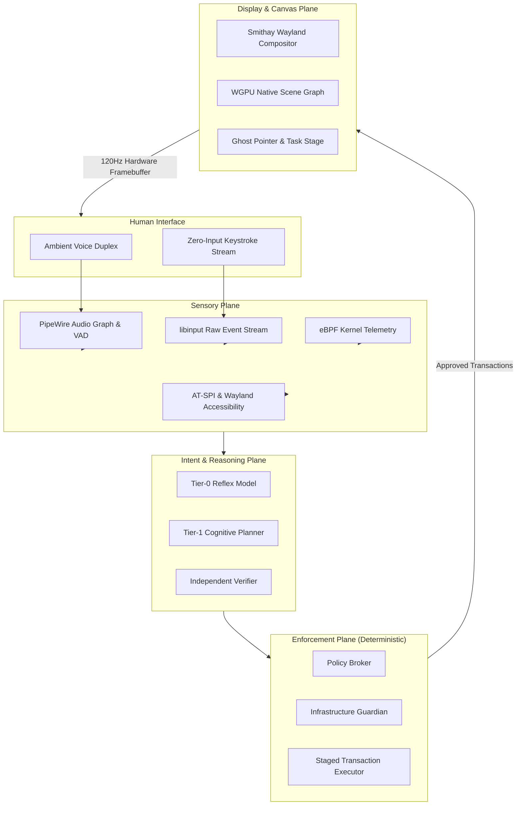

# Arc (Archimedes)

> *"Give me a lever long enough and a fulcrum on which to place it, and I shall move the world."*  
> — Archimedes of Syracuse

**Arc** is an intent-first, autonomous operating substrate. It is not an application, not a chatbot widget, and not an overlay tool. It is the operating system interface itself—a custom Wayland compositor built directly on Rust, WGPU, and modern Linux primitives.

In Arc, the human's intent is the will, Arc is the lever, and the operating system is the fulcrum.

---

## The Paradigm Shift

Every major operating system since the 1973 Xerox Alto has relied on the **WIMP** metaphor: Windows, Icons, Menus, and Pointer. You search through directories, locate applications, position windows, click input boxes, and manually coordinate files and processes.

Arc abolishes this 50-year-old scaffolding:

1. **The Ambient Void (Zero-Input Canvas)**:
   Arc boots in under 1.5 seconds directly to a black OLED canvas via DRM/KMS. There is no dock, no desktop icons, and no search bar. When you type or speak, the display server itself captures your intent and streams kinetic typography across the screen.
2. **Generative Domain Scenes**:
   Directories are no longer walls of filenames (`ls`). Querying your files generates a high-fidelity visual scene tailored to the domain: an acoustic listening room for music, a structured research desk for papers, or an interactive pipeline diagram for a codebase.
3. **Autonomous Visible Agency**:
   When you ask Arc to perform complex real-world workflows—such as inspecting email, navigating job boards, or configuring machine learning pipelines—Arc stages and executes the task visibly. Windows open, ghost pointers navigate, and actions occur with physical spring dynamics and sub-pixel precision.
4. **Dual-Channel Execution**:
   To prevent the fragility of traditional computer-vision agents, Arc separates *visual choreography* (what you see) from *deterministic control* (CDP, AT-SPI, eBPF, and kernel APIs). Actions are 100% reliable and visually transparent.
5. **Native Full-Duplex Audio**:
   Integrated directly into Linux's PipeWire pro-audio graph, Arc listens and speaks with sub-200ms roundtrip latency, featuring automatic audio ducking and biological speech cadence.

---

## Architectural Planes

Arc is divided into four distinct planes:

- **Sensory Plane**: Real-time perception through PipeWire, `libinput`, AT-SPI, and eBPF kernel monitors.
- **Intent Plane**: Fast local reflex models (for streaming UI and keyboard parsing) paired with deep cognitive planners.
- **Enforcement Plane**: Inherited from Aios's battle-tested security core—the Policy Broker, Infrastructure Guardian, and Staged Transaction Executor ensure no model possesses unchecked authority.
- **Display Plane**: A custom Rust Wayland compositor (`smithay` + `wgpu`) rendering 2.5D amphitheater window stages, kinetic typography, and generative domain scenes at native display refresh rates.

---

## Documentation Navigation

The documentation for Arc follows rigorous engineering contracts and traceable specifications:

| Document | Purpose |
|---|---|
| [`docs/doc-progress.md`](docs/doc-progress.md) | Living documentation status tracker and dependency graph |
| [`docs/architecture.md`](docs/architecture.md) | The master architectural essay, system planes, and visual contracts |
| [`docs/requirements.md`](docs/requirements.md) | Traceable requirements (`REQ-BOOT`, `REQ-UX`, `REQ-SCENE`, `REQ-AGENT`, `REQ-AUDIO`, `REQ-SAF`) |
| [`docs/glossary.md`](docs/glossary.md) | Standard terminology and conceptual definitions |
| [`docs/decisions/`](docs/decisions/) | Numbered Architecture Decision Records (ADR-0001 through ADR-0008) |
| [`docs/milestones/`](docs/milestones/) | Phased implementation milestones, acceptance criteria, and test ledgers |

---

## Core Principles

1. **The Machine Is Quiet By Default**: The system never initiates unprompted visual noise. It waits in the void for the human will.
2. **No Unrestricted Execution**: Every mutating system or web action must pass through the Policy Broker and Guardian.
3. **Visible Choreography Over Headless Magic**: The user must always be able to watch the system work. Transparency breeds trust.
4. **Deterministic Substrate, Probabilistic Mind**: Models recommend, compose, and diagnose; deterministic code enforces, isolates, and verifies.

---

## License

Arc is free software: you can redistribute it and/or modify it under the terms of the **GNU General Public License as published by the Free Software Foundation, version 3 (GPLv3)**. See [LICENSE](LICENSE) for details.
