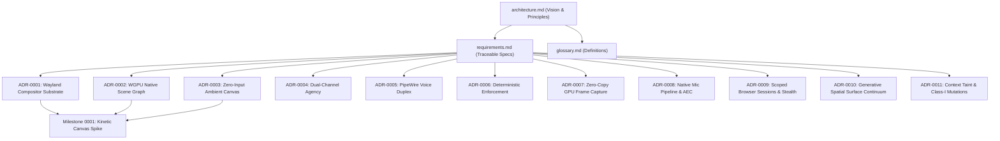

# Arc Documentation Progress

**Status:** Living document  
**Last updated:** 2026-09-11  

This document tracks the authoring, review, and acceptance status of the Arc documentation suite.

---

## Status Legend

| Marker | Meaning |
|---|---|
| ✅ | Complete — reviewed and accepted |
| 📝 | Drafted — content written, under active review |
| 📋 | Stub — outline exists, content pending |
| ❌ | Missing — planned but not yet started |

---

## Progress Overview

| Document | Category | Status | Notes |
|---|---|---|---|
| [`architecture.md`](architecture.md) | Vision & Foundation | 📝 Drafted | Master architectural vision and visual design manifesto |
| [`requirements.md`](requirements.md) | Requirements | 📝 Drafted | Traceable requirement specifications (`REQ-*`) |
| [`glossary.md`](glossary.md) | Terminology | 📝 Drafted | Canonical Arc domain concepts |
| [`decisions/0001-wayland-compositor-as-operating-substrate.md`](decisions/0001-wayland-compositor-as-operating-substrate.md) | ADR | 📝 Drafted | Smithay-based Wayland compositor in Rust |
| [`decisions/0002-wgpu-native-scene-graph-over-webviews.md`](decisions/0002-wgpu-native-scene-graph-over-webviews.md) | ADR | 📝 Drafted | Elimination of WebViews; direct WGPU rendering |
| [`decisions/0003-zero-input-ambient-canvas.md`](decisions/0003-zero-input-ambient-canvas.md) | ADR | 📝 Drafted | Global keyboard intent capture without input widgets |
| [`decisions/0004-dual-channel-computer-use-visual-choreography.md`](decisions/0004-dual-channel-computer-use-visual-choreography.md) | ADR | 📝 Drafted | Decoupling visual animation from deterministic IPC |
| [`decisions/0005-pipewire-native-full-duplex-audio.md`](decisions/0005-pipewire-native-full-duplex-audio.md) | ADR | 📝 Drafted | PipeWire audio node, Silero VAD, streaming local TTS/STT |
| [`decisions/0006-deterministic-enforcement-plane.md`](decisions/0006-deterministic-enforcement-plane.md) | ADR | 📝 Drafted | Arc Deterministic Policy Broker, Guardian, and Staged Executor |
| [`decisions/0007-zero-copy-gpu-frame-capture.md`](decisions/0007-zero-copy-gpu-frame-capture.md) | ADR | 📝 Drafted | DMA-BUF and Vulkan/CUDA zero-copy VRAM-to-VRAM frame ingestion |
| [`decisions/0008-native-microphone-sensory-pipeline-aec.md`](decisions/0008-native-microphone-sensory-pipeline-aec.md) | ADR | 📝 Drafted | Direct ALSA ring buffers, WebRTC AEC, and low-power VAD barge-in |
| [`decisions/0009-scoped-browser-sessions-and-stealth.md`](decisions/0009-scoped-browser-sessions-and-stealth.md) | ADR | 📝 Drafted | Scoped TPM2 browser session bridging, CDP stealth, and 2FA handover |
| [`decisions/0010-generative-spatial-surface-continuum.md`](decisions/0010-generative-spatial-surface-continuum.md) | ADR | 📝 Drafted | Post-application OS: Engine Pipes, spatial surfaces, living bookmark wall |
| [`decisions/0011-data-provenance-taint-tracking-and-irreversible-actions.md`](decisions/0011-data-provenance-taint-tracking-and-irreversible-actions.md) | ADR | 📝 Drafted | Context taint tracking, Class-I irreversible actions, cryptographic signoff |
| [`milestones/0001-nested-smithay-kinetic-canvas-spike.md`](milestones/0001-nested-smithay-kinetic-canvas-spike.md) | Milestone | 📝 Drafted | Milestone 1: Nested Smithay spike, kinetic typography |

---

## Summary Statistics

```text
Design docs:   3 of 3 drafted   (100%)
ADRs:          11 of 11 drafted (100%)
Milestones:    1 of 1 drafted   (100%)
Total suite:   15 documents drafted
```

---

## Document Dependency Graph


